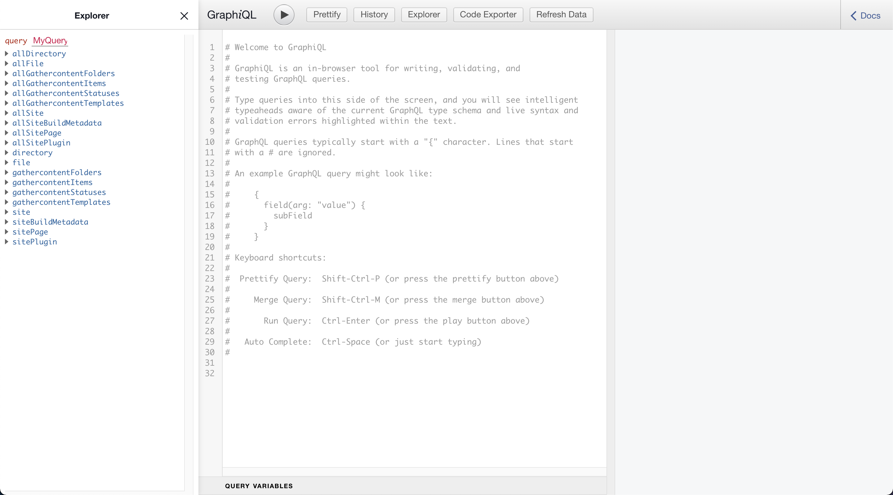

# Sourcing from GatherContent

## Getting Started

### Prerequisites

- You have a [GatherContent](https://gathercontent.com/) account.

- You have a GatherContent [API Key](https://docs.gathercontent.com/reference#authentication).

- You have a project in GatherContent (preferably a demo project named "Course records (headless CMS example))".

This guide references details from the demo project "Course records (headless CMS example)".

If you can't find this project on your account then our [support team](https://gathercontent.com) can help.

### Create a new Gatsby site

Let's begin by creating a new Gatsby site (using the GatherContent starter).

```cli
gatsby new gatsby-site https://github.com/gathercontent/gatsby-starter-gathercontent
```

Once complete, navigate to the project with `cd gatsby-site`.

The Gatsby command and starter repo should have already installed your project ready to be configured.

### Configure the plugin

Now is time to configuration the project. Create a `.env.development` file and populate it with the prerequisite data.

```
# .env.development
GATSBY_GC_EMAIL=<email>
GATSBY_GC_API_KEY=<your_api_key>
GATSBY_GC_PROJECT_ID=<project_id> // you can find this in the project settings
```

### Inspecting the sourced data

Start the environment by running `npm run develop`. Once running you can access GraphiQL, a fantastic tool for exploring the data.

Navigate to `http://localhost:8000/___graphql`



Gatsby generates two different root query fields for each node and as you can see, the following nodes are now available:

- `gathercontentItems` & `allGathercontentItems`
- `gathercontentFolders` & `allGathercontentFolders`
- `gathercontentTemplates` & `allGathercontentTemplates`
- `gathercontentStatuses` & `allGathercontentStatuses`

## Querying your content

### Query a collection of items

We can write GraphQL queries to return a collection of items using `allGathercontentItems`.

```graphql
{
  allGathercontentItems {
    nodes {
      id
      name
      slug
      itemContent {
        courseData {
          weeks
          totalSeats
          hours
          credits
          courseName
          courseCode
        }
      }
    }
  }
}
```
```json
{
  "data": {
    "allGathercontentItems": {
      "nodes": [
        {
          "id": "007248cf-912c-52fa-89b1-31a6ffe94ac1",
          "name": "College of Science and Engineering",
          "slug": "college-of-science-and-engineering",
          "itemContent": {
            "courseData": null
          },
          "template": {
            "name": "Landing page"
          }
        },
        {
          "id": "d989a7ee-9ad5-5171-8559-4d451f2a7197",
          "name": "College of Veterinary Studies",
          "slug": "college-of-veterinary-studies",
          "itemContent": {
            "courseData": {
              "weeks": "26 weeks\n",
              "totalSeats": "60 seats\n",
              "hours": "30 hours\n",
              "credits": "16\n",
              "courseName": "Global Agriculture (GAgr) \n",
              "courseCode": "GAGR 563\n"
            }
          },
          "template": {
            "name": "Course record"
          }
        },
        ...more results
      ]
    }
  }
}
```

### Filtering a query

`Items` are related to `Folders`, `Templates` and `Statuses`, which is useful for filtering & grouping.

Let's query all the items, that live in a folder with the slug of "engineering",

```graphql
{
  allGathercontentItems(filter: {folder: {slug: {eq: "engineering"}}}) {
    nodes {
      id
      name
      slug,
      itemContent {
        courseData {
          weeks
          totalSeats
          hours
          credits
          courseName
          courseCode
        }
      },
      template {
        name
      }
    }
  }
}
```

```json
{
  "data": {
    "allGathercontentItems": {
      "nodes": [
        {
          "id": "6c50f69e-16ed-55d4-8c1e-5b9a13c196d6",
          "name": "Engineering",
          "slug": "engineering",
          "itemContent": {
            "courseData": null
          },
          "template": {
            "name": "Landing page"
          }
        },
        {
          "id": "29491c0f-76ff-5263-b1b1-a4632165fcca",
          "name": "Civil Engineering",
          "slug": "civil-engineering",
          "itemContent": {
            "courseData": {
              "weeks": "24 weeks\n",
              "totalSeats": "30 seats\n",
              "hours": "12 hours\n",
              "credits": "20\n",
              "courseName": "Civil Engineering (CEng)\n",
              "courseCode": "CIVI 999\n"
            }
          },
          "template": {
            "name": "Course record"
          }
        },
        ...more results
      ]
    }
  }
}
```

Querying items is especially useful for building listings for your project and in the example above we were able to query items for the engineering folder.

Let's add another filter to only query course content. In GatherContent, templates are useful for this.

```graphql
{
  allGathercontentItems(
    filter: {folder: {slug: {eq: "engineering"}}, template: {slug: {eq: "course-record"}}}
  ) {
    nodes {
      id
      name
      slug
      itemContent {
        courseData {
          weeks
          totalSeats
          hours
          credits
          courseName
          courseCode
        }
      }
    }
  }
}
```

```json
{
  "data": {
    "allGathercontentItems": {
      "nodes": [
        {
          "name": "Civil Engineering",
          "id": "29491c0f-76ff-5263-b1b1-a4632165fcca",
          "slug": "civil-engineering",
          "itemContent": {
            "courseData": {
              "weeks": "24 weeks\n",
              "totalSeats": "30 seats\n",
              "hours": "12 hours\n",
              "credits": "20\n",
              "courseName": "Civil Engineering (CEng)\n",
              "courseCode": "CIVI 999\n"
            }
          }
        },
        {
          "name": "Mechanical Engineering (MEng)",
          "id": "b5b6cd10-185f-58c8-9a54-dc4691f202b9",
          "slug": "mechanical-engineering-meng",
          "itemContent": {
            "courseData": {
              "weeks": "36 weeks\n",
              "totalSeats": "55 seats\n",
              "hours": "20 hours\n",
              "credits": "13\n",
              "courseName": "Mechanical Engineering (MEng)\n",
              "courseCode": "IRON 247\n"
            }
          }
        },
        ...more results
      ]
    }
  }
}
```

This example is now only querying items with the `course-record` template.

#### Query a single node

You may want to query a single item (e.g. to show a single course page). To do that you can utilise `gathercontentItems`.

```graphql
{
  gathercontentItems(slug: {eq: "civil-engineering"}) {
    id
    slug
    name
    itemContent {
      metadata {
        title
        keywords
        description
      }
      courseData {
        courseCode
        courseName
        credits
        hours
        weeks
        totalSeats
      }
      courseDescription {
        photoOfCourse {
          optimisedImageUrl
        }
      }
    }
  }
}
```

```json
{
  "data": {
    "gathercontentItems": {
      "id": "29491c0f-76ff-5263-b1b1-a4632165fcca",
      "slug": "civil-engineering",
      "name": "Civil Engineering",
      "itemContent": {
        "metadata": {
          "title": "Civil Engineering Course\n",
          "keywords": "GatherContent, course, education\n",
          "description": "A description about our Civil Engineering Course.\n"
        },
        "courseData": {
          "courseCode": "CIVI 999\n",
          "courseName": "Civil Engineering (CEng)\n",
          "credits": "20\n",
          "hours": "12 hours\n",
          "weeks": "24 weeks\n",
          "totalSeats": "30 seats\n"
        },
        "courseDescription": {
          "photoOfCourse": [
            {
              "optimisedImageUrl": "https://assets.gathercontent.com/NTA3MDU/qU33MYWGnEsJC2gH?auto=format%2Ccompress&s=034108c179efaf722cae52d25abfc6d7"
            }
          ]
        }
      }
    }
  }
}
```

## Summary

Following this guide should have shown you everything you need to get started with GatherContent and Gatsby. Together they are a powerful tool for getting your projects up and running quickly.
